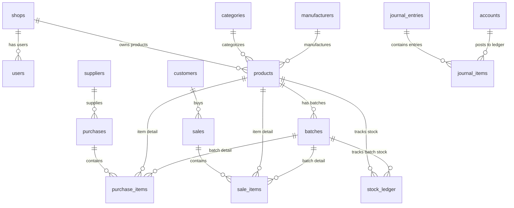
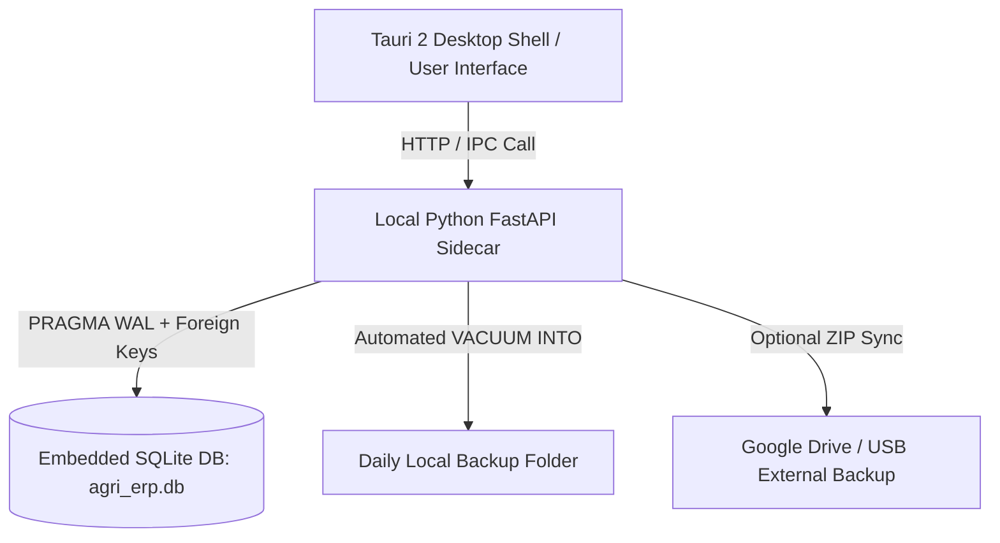

# 🗄️ KRUSHIDHAN AGRI-INPUT SHOP ERP — डेटाबेस आर्किटेक्चर ऑडिट रिपोर्ट

> **ऑडिट तारीख:** १६ सप्टेंबर २०२६  
> **अधिक्षक (Auditor):** Senior Software & Database Architect  
> **नियम निर्देश:** database मध्ये कोणताही बदल केलेला नाही. हे संपूर्ण दस्तऐवजीकरण (Documentation) सध्याच्या कोडबेसमधील प्रत्यक्ष कोड आणि स्कीमावर आधारित आहे.

---

## 📋 १. कार्यकारी सारांश (Executive Summary)

* **वापरलेला डेटाबेस (Current Database Engine):** **SQLite 3** (`sqlite3` मानक पायथन मॉड्यूल)
* **डेटाबेस फाइल लोकेशन:** 
  * स्थानिक रनटाइम (Local Desktop/Dev): `data/agri_erp.db` (पर्यायी ट्रॅकिंग file path `data/krushidhan.db`)
  * सर्व्हरलेस / Vercel: `/tmp/agri_erp.db` (`connection.py:31` नुसार dynamic fallback)
* **ऑफलाईन / क्लाऊड अवलंबित्व (Cloud Dependency):** **१००% ऑफलाईन (0% Internet Required)**
  * डेटाबेस पूर्णपणे संगणकाच्या हार्ड डिस्कवर स्थानिक फाईल स्वरूपात (Embedded SQLite) चालतो.
  * कोणत्याही क्लाऊड सर्व्हर किंवा इंटरनेट कनेक्शनची आवश्यकता नाही.
  * (`requirements.txt` मध्ये `pymongo` सूचीबद्ध आहे, परंतु कोडमध्ये MongoDB चा वापर **शून्य** आहे.)

---

## 🔍 २. सध्याच्या डेटाबेसचा सखोल ऑडिट (Database Deep-Dive Audit)

### २.१ डेटाबेस कनेक्शन मॅनेजर (`src/db/connection.py`)
डेटाबेस कनेक्शन आणि कॉन्फिगरेशन `DatabaseManager` क्लासद्वारे नियंत्रित केले जाते:

```python
# SQLite Pragmas (connection.py:56-60)
PRAGMA foreign_keys = ON;        -- Foreign Key Constraints सक्तीचे लागू
PRAGMA journal_mode = WAL;       -- Write-Ahead Logging (उच्च परफॉर्मन्स & Multi-read concurrency)
PRAGMA synchronous = NORMAL;     -- Disk Flush फ्रिक्वेन्सी संतुलित
PRAGMA busy_timeout = 5000;      -- डेटाबेस लॉक झाल्यास ५ सेकंद वेट टाइम
```

### २.२ स्कीमा आणि टेबल संरचना (Full Schema & Tables Inventory)
डेटाबेसमध्ये एकूण **२४ टेबल्स (Tables)** समाविष्ट आहेत (`src/db/schema.sql`):

| # | टेबलचे नाव | वर्णन / कार्य (Purpose) | प्रमुख स्तंभ (Key Columns) |
|---|---|---|---|
| **१** | `shops` | दुकानाची माहिती (Single/Multi tenant root) | `id`, `name`, `gstin`, `license_no`, `address`, `phone` |
| **२** | `users` | युझर्स व ऑथेंटिकेशन | `id`, `shop_id`, `username`, `password_hash`, `role`, `permissions_json` |
| **३** | `categories` | खते, बियाणे, कीटकनाशके कॅटेगरी | `id`, `shop_id`, `name`, `description` |
| **४** | `manufacturers` | उत्पादक कंपन्या (उदा. Mahyco, Bayer) | `id`, `shop_id`, `name`, `contact_person`, `phone` |
| **५** | `products` | शेती उत्पादनांची मास्टर माहिती | `id`, `shop_id`, `category_id`, `manufacturer_id`, `name`, `hsn_code`, `unit` |
| **६** | `batches` | बॅच ट्रॅकिंग, एक्सपायरी, साठा, किमती | `id`, `shop_id`, `product_id`, `batch_number`, `expiry_date`, `mrp`, `sale_price`, `current_stock` |
| **७** | `suppliers` | पुरवठादार (डीलर / कंपनी) | `id`, `shop_id`, `name`, `gstin`, `phone`, `current_balance` |
| **८** | `customers` | शेतकरी / ग्राहक | `id`, `shop_id`, `name`, `phone`, `aadhar_no`, `gstin`, `current_balance` |
| **९** | `purchases` | खरेदी बिल (Inward Purchase Header) | `id`, `shop_id`, `supplier_id`, `invoice_number`, `invoice_date`, `total_amount`, `net_amount` |
| **१०** | `purchase_items` | खरेदी बिलातील वस्तू व किमती | `id`, `purchase_id`, `product_id`, `batch_id`, `quantity`, `purchase_price`, `gst_rate` |
| **११** | `sales` | विक्री बिल (POS Sales Header) | `id`, `shop_id`, `customer_id`, `invoice_number`, `invoice_date`, `net_amount`, `paid_amount` |
| **१२** | `sale_items` | विक्री बिलातील वस्तू व किमती | `id`, `sale_id`, `product_id`, `batch_id`, `quantity`, `unit_price`, `gst_rate` |
| **१३** | `stock_ledger` | साठ्याचा हिशोब (Inward/Outward Ledger) | `id`, `shop_id`, `product_id`, `batch_id`, `reference_type`, `qty_in`, `qty_out`, `balance_qty` |
| **१४** | `sale_returns` | ग्राहक माल परतावा (स्कीमा उपलब्ध) | `id`, `sale_id`, `return_date`, `refund_amount`, `reason` |
| **१५** | `sale_return_items` | परतावा वस्तू सूची (स्कीमा उपलब्ध) | `id`, `return_id`, `product_id`, `batch_id`, `quantity`, `refund_rate` |
| **१६** | `purchase_returns` | पुरवठादार माल परतावा (स्कीमा उपलब्ध) | `id`, `purchase_id`, `return_date`, `refund_amount`, `reason` |
| **१७** | `purchase_return_items` | खरेदी परतावा वस्तू सूची | `id`, `return_id`, `product_id`, `batch_id`, `quantity`, `refund_rate` |
| **१८** | `accounts` | खातेपुस्तके (Ledgers / Chart of Accounts) | `id`, `shop_id`, `account_name`, `account_type`, `current_balance` |
| **१९** | `journal_entries` | डबल-एंट्री व्हाउचर्स (Header) | `id`, `shop_id`, `voucher_number`, `voucher_type`, `entry_date` |
| **२०** | `journal_items` | नावे व जमा नोंदी (Debit / Credit) | `id`, `journal_id`, `account_id`, `debit_amount`, `credit_amount` |
| **२१** | `payments` | जमा व नावे व्यवहार (Receipts/Payments) | `id`, `shop_id`, `party_type`, `party_id`, `amount`, `payment_mode` |
| **२२** | `expenses` | दुकानाचे दैनंदिन खर्च | `id`, `shop_id`, `category`, `amount`, `expense_date` |
| **२३** | `audit_logs` | युझर ॲक्टिव्हिटी लॉग | `id`, `shop_id`, `user_id`, `action`, `table_name`, `old_values`, `new_values` |
| **२४** | `backup_log` | बॅकअप ट्रॅकिंग लॉग | `id`, `file_path`, `backup_type`, `backup_size_bytes`, `status`, `created_at` |

---

## 🔗 ३. नातेसंबंध आणि व्यवहार (Relationships & Transactions Audit)

### ३.१ फॉरेन की नातेसंबंध (Foreign Key Relationships Diagram)



### ३.२ व्यवहार व्यवस्थापन (Transaction Handling)
* **Context Manager implementation (`connection.py:109-120`):**
  ```python
  @contextmanager
  def transaction(self):
      conn = self.get_connection()
      try:
          yield conn
          conn.commit()  # यशस्वी झाल्यास कमिट
      except Exception:
          conn.rollback() # त्रुटी आल्यास तात्काळ रोलबॅक
          raise
      finally:
          conn.close()
  ```
* **ॲटोमॅसिटी (Atomicity):** Purchase Inward आणि Sale Invoice दोन्ही व्यवहार ॲटोमिक आहेत. जर विक्री बिलामध्ये ५ आयटम्स असतील आणि ३ ऱ्या आयटमवर त्रुटी आली, तर संपूर्ण बिल रोलबॅक होते. साठा किंवा खातेशिल्लक अर्धवट बदलत नाही.

---

## 🔌 ४. ऑफलाईन डिपेंडन्सी तपासणी (Offline Dependency Audit)

* **डेटाबेस ऑफलाईन कार्यक्षमता:** **१००% स्वयंपूर्ण (100% Offline Standalone)**
* **इंटरनेट आवश्यक आहे का?:** **नाही.** डेटाबेस स्थानिक SQLite फाईल स्वरूपात काम करतो.
* **क्लाऊड सिंक कोड:** सध्याच्या कोडमध्ये क्लाऊड सिंक किंवा रिमोट रिप्लिकेशनचे **कोणतेही कोड अस्तित्वात नाही**.
* **Vercel Serverless मर्यादा:** Vercel वर डीप्लॉय केल्यावर `/tmp/agri_erp.db` मध्ये SQLite फाईल तयार होते. परंतु सर्व्हरलेस कंटेनर रिस्टार्ट झाल्यावर `/tmp` डेटा नष्ट होतो. **म्हणून हे ॲप डेस्कटॉप / स्थानिक पीसी वरच चालवणे योग्य आहे.**

---

## ⚖️ ५. SQLite चे मूल्यमापन (SQLite Evaluation for Agri ERP)

| निकष (Criterion) | मूल्यांकन (Evaluation) | शेरा (Verdict) |
|---|---|---|
| **डेटा सुरक्षितता & ACID Compliance** | पूर्णपणे ACID Compliant. पॉवर कट (वीज गेल्यास) WAL मोडमुळे डेटा करप्ट होत नाही. | ✅ अत्यंत उत्तम |
| **एका दुकानासाठी (Single Shop Desktop)** | ०% मेंटेनन्स. अतिरिक्त SQL Server किंवा MySQL इन्स्टॉल करायची गरज नाही. | ✅ सर्वोत्तम पर्याय |
| **मल्टी-काउंटर (Multi-POS Counters)** | WAL Mode मुळे एकाच दुकानात ३ ते ५ कॉम्प्युटर्सवरून एकाच वेळी बिलिंग शक्य. | ✅ सक्षम |
| **साठा / डेटा मर्यादा** | SQLite फाईल आकार मर्यादा २८१ TB आहे. कृषी दुकानाचा ५ वर्षांचा डेटा ५० MB पेक्षा कमी असतो. | ✅ अमर्याद क्षमता |
| **परफॉर्मन्स (Speed)** | Sub-millisecond read/write टाइम. क्लाऊड DB पेक्षा १०० पटीने वेगाने बिलिंग होते. | ✅ सर्वोत्तम |

---

## 🏢 ६. व्यावसायिक Multi-Shop Isolation स्ट्रॅटेजी

जर भविष्यात एकाच सॉफ्टवेअरवरून अनेक दुकाने (Multi-Shop Franchise / Branches) चालवायची असतील, तर पुढील ३ मॉडेल्सचे मूल्यमापन केले आहे:

### मॉडेल १: Shared Database with `shop_id` (सध्याच्या स्कीमामध्ये अंशतः आहे)
* **स्वरूप:** एकाच SQLite फाईलमध्ये सर्व टेबल्समध्ये `shop_id` कॉलमनुसार डेटा विभक्त करणे.
* **फायदे:** कोडींग सोपे.
* **तोटे:** एका दुकानाचा डेटा चुकीच्या क्वेरीमुळे दुसऱ्या दुकानाला दिसण्याचा (Data Leakage) धोका असतो.

### मॉडेल २: Database-per-Tenant / Shop (🏆 शिफारस केलेले)
* **स्वरूप:** प्रत्येक दुकानासाठी स्वतंत्र SQLite फाईल असणे (उदा. `shop_101.db`, `shop_102.db`).
* **फायदे:**
  1. **१००% डेटा आयसोलेशन:** एका दुकानाचा डेटा दुसऱ्या दुकानात जाणे अशक्य.
  2. **सोपे बॅकअप:** एका दुकानाचा बॅकअप स्वतंत्रपणे घेता येतो किंवा पेनड्राईव्हमध्ये कॉपी करता येतो.
  3. **स्पीड:** फाईलचा आकार लहान राहतो.

---

## 💾 ७. बॅकअप आणि रिस्टोर ऑडिट (Backup & Restore Audit)

### ७.१ बॅकअप यंत्रणा (`src/services/backup_service.py`)
* **बॅकअप पद्धत:** `VACUUM INTO 'filepath'` या SQLite च्या आधुनिक कमांडचा वापर होतो (`backup_service.py:42`).
* **लाइव्ह / ऑनलाईन बॅकअप:** `VACUUM INTO` मुळे चालू सॉफ्टवेअर किंवा बिलिंग न थांबवता (Non-blocking Live Backup) सेकंदात बॅकअप फाईल तयार होते.
* **हेल्थ व्हेरीफिकेशन:** रिस्टोर करण्यापूर्वी `PRAGMA quick_check;` द्वारे बॅकअप फाईल करप्ट आहे की नाही हे तपासले जाते (`backup_service.py:68`).
* **लॉगिंग:** प्रत्येक बॅकअपची नोंद `backup_log` टेबलमध्ये ठेवली जाते.

### ७.२ बॅकअपमधील त्रुटी / धोके:
1. **स्थानिक साठा धोका:** बॅकअप फाईल्स त्याच कॉम्प्युटरच्या `backups/` फोल्डरमध्ये साठवल्या जातात. कॉम्प्युटरची हार्ड डिस्क खराब झाल्यास डेटा नष्ट होऊ शकतो.
2. **ऑटो-रोटेशन नाही:** जुने बॅकअप आपोआप डिलीट होण्याची ऑटो-डिलीट / रोटेशन पॉलिसी सध्या कोडमध्ये नाही.

---

## 🔒 ८. डेटाबेस सुरक्षा ऑडिट (Database Security Audit)

1. **डेटा एनक्रिप्शन (Encryption at Rest):**
   * **सध्याची स्थिती:** `agri_erp.db` फाईल अन-एनक्रिप्टेड (Plaintext) आहे. कोणताही व्यक्ती SQLite Browser सॉफ्टवेअर वापरून डेटा बघू शकतो.
   * **उपाय:** भविष्यात **SQLCipher** वापरून ६४-बिट एनक्रिप्शन लागू करणे.
2. **SQL Injection सुरक्षा:**
   * **सध्याची स्थिती:** सर्व Repositories मध्ये Parameterized Queries (`?` placeholders) वापरले आहेत.
   * **निष्कर्ष:** SQL Injection चा कोणताही धोका नाही.
3. **युझर पासवर्ड सुरक्षा:**
   * **सध्याची स्थिती:** `werkzeug.security` (PBKDF2-SHA256) हॅशिंग वापरले आहे. पासवर्ड प्लेन टेक्स्ट स्वरूपात सेव्ह होत नाहीत.

---

## 🚀 ९. Tauri 2 सुसंगतता आणि मूल्यांकन (Tauri 2 Compatibility Audit)

Tauri 2 हे आधुनिक डेस्कटॉप फ्रेमवर्क आहे जे Electron च्या तुलनेत अतिशय हलके (Lightweight) आहे.

### ➕ फायदे (Advantages of Tauri 2 + SQLite)
1. **अत्यंत लहान ऍप्लिकेशन आकार:** Tauri 2 ॲपचा आकार फक्त १५ ते २० MB असतो (Electron १००+ MB असतो).
2. **नेटीव्ह SQLite सपोर्ट:** Tauri 2 मध्ये Rust चा `tauri-plugin-sql` द्वारे SQLite अत्यंत वेगाने आणि सुरक्षितपणे चालतो.
3. **कमकुवत PC वरही वेगवान:** जुन्या Windows 7/10 4GB RAM कॉम्प्युटरवरही त्वरित सुरू होते.
4. **स्थानिक बॅकअप सोपा:** SQLite फाईल थेट युझरच्या `Documents` किंवा `AppData` फोल्डरमध्ये सुरक्षित ठेवता येते.

### ➖ तोटे / आव्हाने (Disadvantages & Challenges)
1. **आर्किटेक्चर बदल:** सध्याचे बॅकएंड पायथन FastAPI / HTML Jinja2 वर आधारित आहे. Tauri 2 वापरताना:
   * **पर्याय A (Sidecar Pattern):** पायथन बॅकएंड `PyInstaller` द्वारे एक्झिक्युटेबल (.exe) बनवून Tauri ॲपसोबत बॅकग्राउंडमध्ये चालवणे.
   * **पर्याय B (Native Migration):** संपूर्ण पायथन API लॉजिक Rust मध्ये किंवा JavaScript Frontend मध्ये पुन्हा लिहावे लागेल.
2. **ब्राउझर व्ह्यू फरक:** Windows वर Edge WebView2 चा वापर होतो, ज्यामुळे काही जुन्या संगणकांवर WebView2 इन्स्टॉल असणे आवश्यक ठरते.

---

## 🏗️ १०. शिफारस केलेले आर्किटेक्चर (Recommended Architecture)



1. **डेटाबेस इंजिन:** SQLite 3 (WAL Mode चालू ठेवून).
2. **डेटा आयसोलेशन:** Single Shop साठी स्वतंत्र `.db` फाईल.
3. **बॅकअप स्ट्रॅटेजी:** 
   * दररोज दुकाने बंद करताना ॲटोमॅटिक `VACUUM INTO` बॅकअप.
   * बॅकअप फाईल स्थानिक `C:\KrushidhanBackups` आणि पेनड्राईव्ह / Google Drive वर सेव्ह करणे.
4. **डेस्कटॉप ॲप:** Tauri 2 + Python FastAPI Sidecar Architecture.

---

## 🛣️ ११. भविष्यातील सुरक्षित स्थलांतर योजना (Safe Future Migration Plan)

> **नोंद:** खालील टप्पे भविष्यातील मार्गदर्शनासाठी फक्त डॉक्युमेंट केले आहेत. डेटाबेसमध्ये कोणताही बदल करण्यात आलेला नाही.

### टप्पा १: डेटाबेस सुरक्षा व मजबुतीकरण (Database Hardening)
1. `PRAGMA foreign_keys = ON;` प्रत्येक ट्रान्झॅक्शनमध्ये सक्तीचे करणे.
2. साठा उणे (Negative Stock) होण्यापासून रोखण्यासाठी `CHECK (current_stock >= 0)` कन्स्ट्रेंट जोडणे.

### टप्पा २: बॅकअप ऑटोमेशन (Automated Backup Hardening)
1. बॅकअप घेताना फाईल आपोआप ZIP करून पासवर्ड प्रोटेक्टेड करणे.
2. ३० दिवसांपेक्षा जुने बॅकअप आपोआप डिलीट करणारी रोटेशन सायकल लागू करणे.

### टप्पा ३: एनक्रिप्शन लागू करणे (Data Encryption)
1. SQLite ऐवजी `SQLCipher` वापरून संपूर्ण डेटाबेस फाईल मास्टर पासवर्डने एनक्रिप्ट करणे.

---

### 📌 अंतिम निष्कर्ष (Conclusion)
सध्याचा कृषी दुकान ERP चा डेटाबेस **SQLite 3 वर १००% ऑफलाईन चालण्यासाठी पूर्णपणे सक्षम व सुरक्षित आहे**. यामध्ये कोणत्याही क्लाऊड किंवा इंटरनेटची गरज नाही. सर्व व्यवहार (Purchase & Sale) ॲटोमिक आहेत आणि बॅकअप यंत्रणा `VACUUM INTO` मुळे थेट चालू सॉफ्टवेअरमध्येही निर्धोक काम करते.
