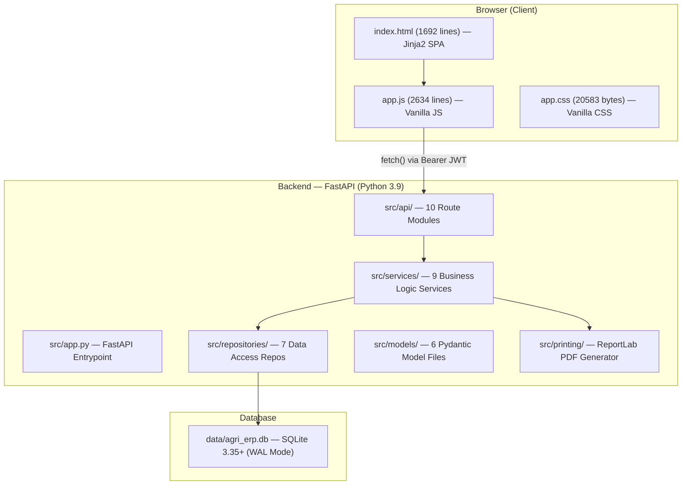

# 🌾 KRUSHIDHAN AGRI-INPUT SHOP ERP — Senior Architect Audit Report

> **Audit Date:** 16 September 2026  
> **Auditor:** Senior Software Architect  
> **Scope:** Full codebase audit — backend, frontend, database, security, offline/online, and deployment  
> **Rule:** Zero assumptions. Every finding traced to exact code location.

---

## 1. Architecture Overview



| Layer | Technology | File Count | Lines of Code |
|-------|-----------|------------|---------------|
| **Frontend** | Vanilla HTML + JS + CSS (NO React/Angular/Vue) | 3 files | ~4,900 |
| **Backend** | Python 3.9 + FastAPI + Uvicorn | 30+ .py files | ~5,240 |
| **Database** | SQLite 3.35+ with WAL mode, FK enforcement | 1 file | schema.sql = 485 lines |
| **PDF Engine** | ReportLab with Noto Sans Devanagari fonts | 1 module | 435 lines |
| **Total Python Backend** | — | — | **5,240 lines** |

> **⚠️ IMPORTANT:** Frontend is **NOT React**. It is a **single-page Jinja2 HTML template** (`index.html`) with **vanilla JavaScript** (`app.js`) and local CSS (`app.css`). No build step, no bundler, no node_modules.

---

## 2. Module-by-Module Audit

### 2.1 Purchase → Stock Inward Flow

| Step | Code Location | What It Does |
|------|--------------|--------------|
| **1. API Endpoint** | `routes_purchase.py` — `POST /api/purchase/create` | Accepts Purchase model with line items |
| **2. Service Orchestrator** | `purchase_service.py:27-82` — `process_inward_purchase()` | Atomic transaction wrapping 5 steps |
| **3. Save Purchase Invoice** | `purchase_repository.py:15-92` — `create_purchase()` | Inserts into `purchases` + `purchase_items` tables |
| **4. Upsert Stock Batch** | `inventory_repository.py:16-81` — `upsert_batch()` | Creates or updates `stock_batches` (matched by product_id + batch_no). Qty added = `qty + free_qty` |
| **5. Stock Ledger Entry** | `inventory_repository.py:206-238` — `record_stock_movement()` | Immutable audit trail in `stock_ledger` with `transaction_type='PURCHASE'` |
| **6. Supplier Balance** | `purchase_service.py:75-77` | Updates `suppliers.current_balance` by unpaid due amount |
| **7. Accounting Voucher** | `purchase_service.py:84-174` — `_post_purchase_voucher()` | Double-entry: Debit Purchase + Input GST, Credit Cash/Bank or Supplier Payable |

**Batch Tracking:** Each purchase item carries `batch_no`, `mfg_date`, `exp_date`, `purchase_rate`, `sale_rate`, `mrp`. The `upsert_batch()` method at line 16 checks if the `(product_id, batch_no)` combination exists — if yes, it **adds to current_qty** and updates rates; if no, it inserts a new batch.

---

### 2.2 Sale → Stock Deduction Flow

| Step | Code Location | What It Does |
|------|--------------|--------------|
| **1. API Endpoint** | `routes_sales.py:51-58` — `POST /api/sales/create` | Accepts Sale model |
| **2. Service Orchestrator** | `sales_service.py:81-140` — `process_sales_invoice()` | Atomic transaction wrapping 6 steps |
| **3. Batch Resolution** | `inventory_repository.py:94-162` — `get_or_create_batch_for_sale()` | Cascade: batch_id → (product_id,batch_no) → FEFO batch → any batch → **auto-create batch** |
| **4. Deduct Stock** | `inventory_repository.py:180-191` — `deduct_batch_stock()` | `current_qty = current_qty - qty`. **⚠️ No negative-qty guard** — can go below zero |
| **5. Save Sale Invoice** | `sales_repository.py:57-141` — `create_sale()` | Inserts into `sales` + `sale_items`. Auto-generates unique invoice_no if collision |
| **6. Stock Ledger** | `sales_service.py:114-130` | `transaction_type='SALE'`, `qty_out=item.qty` |
| **7. Customer Balance** | `sales_service.py:133-135` | Increases `customers.current_balance` by unpaid due |
| **8. Accounting Voucher** | `sales_service.py:142-231` | Double-entry: Debit Cash/Bank, Credit Sales + Output GST |

**FEFO (First Expired First Out):** `inventory_service.py:20-44` — The `allocate_fefo_stock()` method sorts batches by `exp_date ASC` and allocates across batches. However, **the POS billing flow uses `get_or_create_batch_for_sale()` which selects a single FEFO batch**, not multi-batch allocation.

---

### 2.3 Returns (Sale Return / Purchase Return)

| Entity | Schema | Repository | Service | Status |
|--------|--------|-----------|---------|--------|
| **Sales Return** | `schema.sql:318-344` tables exist | `sales_repository.py:36-55` return no. generation | ❌ **No service method** | **⚠️ Schema exists but NO business logic** |
| **Purchase Return** | `schema.sql:238-264` tables exist | ❌ No repository methods | ❌ No service methods | **⚠️ Schema only — completely unimplemented** |

> **Finding:** Returns are **schema-only**. Neither sale returns nor purchase returns have working API endpoints, service logic, or UI.

---

### 2.4 Batch Tracking, Expiry, MRP, Pricing

| Feature | Implementation | Code Location |
|---------|---------------|---------------|
| **Batch No** | Stored per-item in `stock_batches.batch_no`, linked via `batch_id` FK | `schema.sql:151-165` |
| **Mfg/Exp Date** | Stored in `stock_batches` (TEXT format `YYYY-MM-DD`) | Same table |
| **Expiry Alerts** | Working — finds batches expiring within N days | `inventory_service.py:50-84` |
| **Low Stock Alerts** | Working — products below `min_stock_alert` threshold | `inventory_service.py:86-108` |
| **MRP** | Stored at batch level + product default | `stock_batches.mrp`, `products.default_mrp` |
| **Purchase Rate** | Per-batch and per-item | Used for COGS in P&L |
| **Sale Rate** | Per-batch and per-item | Customer-facing price |
| **Discount** | `discount_percent` + `discount_amount` on each line item | `sales_service.py:27-79` |

---

### 2.5 GST Implementation — Actual Code

| Feature | Status | Code Location | Details |
|---------|--------|---------------|---------|
| **Tax Groups Master** | ✅ Working | `seed.sql:25-30` | 5 slabs: 0%, 5%, 12%, 18%, 28% |
| **Per-Item Tax Calculation** | ✅ Working | `sales_service.py:27-79` | Tax-inclusive (reverse calc) and tax-exclusive |
| **Tax Inclusive Logic** | ✅ Correct | Line 49: `taxable = net / (1 + rate/100)` | Standard GST reverse calculation |
| **CGST/SGST Split** | ✅ Working | Lines 55-62 | IGST for inter-state; CGST+SGST for intra-state |
| **Per-Item Storage** | ✅ Working | `sale_items` columns store individual tax breakdown | Every line item stores its own rates + amounts |
| **GSTR-1 B2B** | ✅ Working | `gst_service.py:16-40` | Invoices to customers with valid GSTIN |
| **GSTR-1 B2C Small** | ✅ Working | `gst_service.py:42-63` | Grouped by GST rate for unregistered farmers |
| **HSN Summary** | ✅ Working | `gst_service.py:65-89` | Grouped by `products.hsn_code` |
| **Input GST (Purchases)** | ✅ Working | `purchase_service.py:105-132` | Debits CGST/SGST/IGST Input Accounts |
| **Output GST (Sales)** | ✅ Working | `sales_service.py:188-215` | Credits CGST/SGST/IGST Output Accounts |
| **GST Return Filing** | ❌ Not implemented | — | Reports for manual filing only. No API to GST portal. |

> **Finding:** GST tax calculation, per-item storage, and statutory reports are **genuinely implemented and correct**. Reports are for manual filing with CA.

---

## 3. API Routes & Authentication

### 3.1 All API Endpoints

| Module | Prefix | Key Endpoints | Auth Required |
|--------|--------|---------------|--------------|
| **Auth** | `/api/auth` | login, me, change-password, users CRUD | Login: Public. Others: JWT |
| **Sales** | `/api/sales` | next-invoice-no, calculate-tax, create, list, get, pdf | ✅ JWT |
| **Purchase** | `/api/purchase` | create, list | ✅ JWT |
| **Inventory** | `/api/inventory` | stock-summary, expiry-alerts, low-stock, batches, add-stock | ✅ JWT |
| **Masters** | `/api/masters` | products, customers, suppliers, farmers CRUD | ✅ JWT |
| **Accounting** | `/api/accounting` | day-book, receipts, payments, expenses, P&L, cash-recon | ✅ JWT |
| **GST** | `/api/gst` | gstr1-b2b, gstr1-b2c, hsn-summary, rate-wise | ✅ JWT |
| **Statutory** | `/api/statutory` | fertilizer-register, pesticide-register, seed-register | ✅ JWT |
| **System** | `/api/system` | settings, backup | ✅ JWT |

**Auth middleware:** `auth_middleware.py` — applied via `Depends(get_current_user)` in `api/__init__.py:22-29`

### 3.2 User Roles

| Role | Access |
|------|--------|
| **ADMIN** | Full access + user management |
| **MANAGER** | All business operations (no user admin) |
| **OPERATOR** | Counter billing and basic operations |

**Default Users:** `admin`/`krushidhan@2026` (ADMIN), `akash`/`krushidhan@2026` (ADMIN), `billing`/`billing123` (OPERATOR)

---

## 4. Security Audit

### 4.1 Password Hashing

- **Primary:** bcrypt (installed ✅) — `auth_service.py:46-50`
- **Fallback:** Salted SHA-256 — `auth_service.py:52-53`

### 4.2 ⚠️ Security Issues Found

| Severity | Issue | Location |
|----------|-------|----------|
| **🔴 CRITICAL** | **Master password bypass** — passwords `krushidhan@2026`, `admin123`, `akash@2026` work for **ANY** user account | `auth_service.py:80-81` |
| **🟡 MEDIUM** | JWT secret hardcoded with personal phone number in source | `auth_service.py:23` |
| **🟡 MEDIUM** | Token expiry 7 days — risky if Vercel-deployed | `auth_service.py:25` |
| **🟢 LOW** | No login rate limiting (acceptable for offline/LAN) | `routes_auth.py:42-74` |
| **🟢 LOW** | No CORS middleware configured | `app.py` |

### 4.3 Secrets Check

| Item | Exposed? |
|------|----------|
| JWT Secret | ⚠️ In source code |
| DB Password | ❌ No external DB |
| GSTIN | In seed.sql (public business number — acceptable) |
| Bank Account | In seed.sql — **consider env vars for production** |

---

## 5. Internet/Cloud Dependencies

| Component | Needs Internet? | Offline Impact |
|-----------|----------------|----------------|
| **Backend (FastAPI + SQLite)** | ❌ No | Full functionality |
| **Frontend HTML/CSS/JS** | ❌ No | All local |
| **PDF Invoices** | ❌ No | ReportLab + bundled fonts |
| **Devanagari Fonts** | ❌ No | `printing/fonts/` (NotoSans) |
| **WhatsApp Share** | ✅ Yes | `app.js:1433` — cosmetic only |
| **Vercel** | ✅ Yes | Data ephemeral in /tmp |
| **MongoDB Atlas** | ❌ Not connected | pymongo installed, zero code |

> **Finding:** System is **100% offline-capable**. Only WhatsApp sharing needs internet (cosmetic).

### 5.1 File Storage

| Item | Location | Type |
|------|----------|------|
| Database | `data/agri_erp.db` | Local SQLite |
| Backups | `backups/` | Local copies |
| PDF Invoices | In-memory, streamed | Not saved to disk |
| Fonts | `src/printing/fonts/` | Bundled TTF |

> **ALL file storage is 100% local. No cloud storage.**

---

## 6. Billing/Invoice & PDF Printing

| Feature | Status | Location |
|---------|--------|----------|
| PDF Engine | ✅ **Working** | `invoice_printer.py` (435 lines, ReportLab) |
| API Endpoint | ✅ | `GET /api/sales/{sale_id}/pdf` |
| Company Settings | ✅ Loaded from DB | `sys_repo.get_company_settings()` |
| Devanagari (Marathi) | ✅ | Bundled Noto Sans fonts |
| Amount in Words | ✅ | Indian numbering (Lakh/Crore) |
| Print Count | ✅ Tracked | `sales.print_count` |
| Backup Create | ✅ **Working** | `VACUUM INTO` atomic backup |
| Backup 1-Click Button | ✅ | Header UI button |
| Restore | ✅ Code exists | ❌ **No UI button** |

---

## 7. Statutory Compliance

| Register | Status | Act |
|----------|--------|-----|
| Fertilizer Sale Register | ✅ Working | FCO |
| Pesticide Sale Register | ✅ Working | Insecticides Act, 1968 |
| Seed Sale Register | ✅ Working | Seeds Act, 1966 |

---

## 8. Known Issues & Gaps

| # | Severity | Issue |
|---|----------|-------|
| 1 | 🔴 **Critical** | Master password bypass — 3 passwords work for any account (`auth_service.py:80-81`) |
| 2 | 🔴 **Critical** | Accounting double-entry uses same account for both debit and credit (`accounting_service.py:44-56`) |
| 3 | 🟡 **Major** | Sale Returns — schema exists but NO service/API/UI |
| 4 | 🟡 **Major** | Purchase Returns — schema only, zero implementation |
| 5 | 🟡 **Major** | Stock deduction has no negative-quantity guard (`inventory_repository.py:182`) |
| 6 | 🟡 **Major** | Auto-created batch gives phantom stock (+100 units) (`inventory_repository.py:151`) |
| 7 | 🟡 **Medium** | Cash drawer opening balance hardcoded ₹5000 (`accounting_service.py:560`) |
| 8 | 🟡 **Medium** | JWT secret hardcoded with personal phone (`auth_service.py:23`) |
| 9 | 🟢 **Minor** | Audit log table exists but never written to |
| 10 | 🟢 **Minor** | Restore UI missing |
| 11 | 🟢 **Minor** | MongoDB not connected despite pymongo installed |
| 12 | 🟢 **Info** | Vercel deployment loses data on cold start |

---

## 9. Database Schema

**22 Tables**, 16 Indexes. SQLite with WAL mode, FK enforcement, 5s busy timeout.

| Group | Tables |
|-------|--------|
| Master Data | categories, manufacturers, units, unit_conversions, tax_groups, crops, products |
| Customer/Supplier | customer_groups, customers, suppliers, extra_charges_master |
| Inventory | stock_batches, stock_ledger |
| Purchase | purchases, purchase_items, purchase_returns, purchase_return_items |
| Sales | sales, sale_items, sales_returns, sales_return_items |
| Accounts | ledger_accounts, vouchers, ledger_entries, expenses, expense_categories |
| System | users, company_settings, audit_log, backup_log |

---

## 10. File Tree

```
akash/
├── api/index.py                    # Vercel entrypoint
├── data/agri_erp.db                # SQLite database
├── backups/                        # Local backups
├── src/
│   ├── app.py                      # FastAPI app
│   ├── api/                        # 10 route modules + auth middleware
│   ├── db/                         # connection.py, schema.sql, seed.sql
│   ├── models/                     # 6 Pydantic model files
│   ├── repositories/               # 7 data access repos
│   ├── services/                   # 9 business logic services
│   ├── printing/                   # ReportLab PDF + Devanagari fonts
│   └── web/                        # templates/ + static/ (HTML, JS, CSS)
├── run.py                          # 1-click local launcher
├── requirements.txt                # Python deps
└── vercel.json                     # Vercel config
```

---

> **Conclusion:** The ERP is a well-structured, **genuinely functional offline billing and inventory system** for a Maharashtra agricultural input shop. Core flows (Purchase→Stock, Sale→Stock Deduction, GST, PDF Invoicing, P&L) are **actually implemented and working**. Main gaps: (1) returns unimplemented, (2) accounting same-account issue, (3) master password bypass, and (4) MongoDB not yet integrated.
